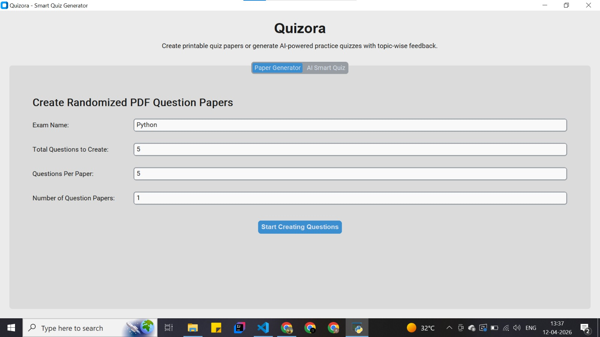
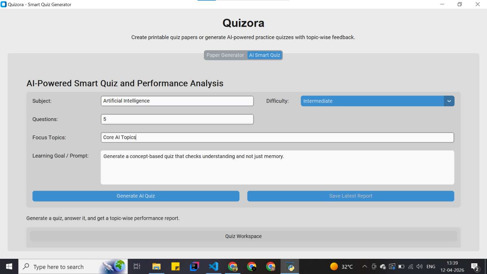
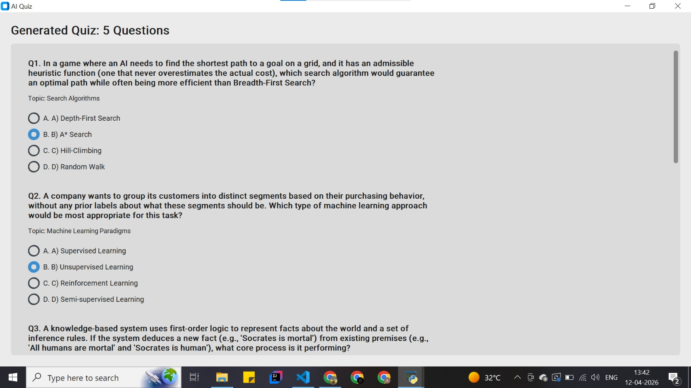
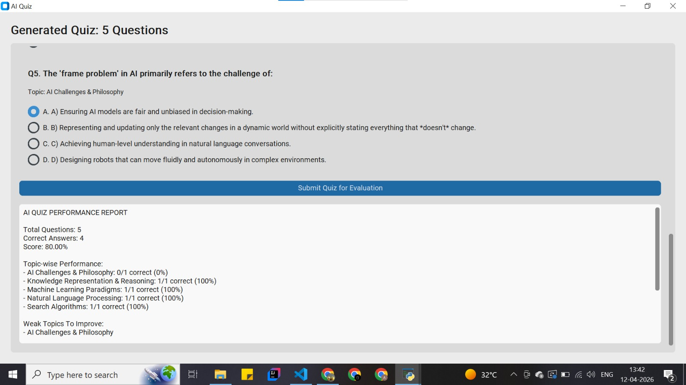

# QuizNova

QuizNova is a desktop quiz application built with Python and CustomTkinter.

It now supports two main workflows:

- `Paper Generator`: Create randomized PDF question papers and a master answer key.
- `AI Smart Quiz`: Generate a Gemini-powered quiz, answer it inside the app, get your score, see topic-wise performance, and identify weak topics to improve.

## Install

```bash
pip install -r requirements.txt
```

## Run

```bash
python quiz_generator.py
```

## AI Smart Quiz Setup

To use the AI quiz feature, add your Gemini API key in one of these ways:

- Add it to `.env` as `GEMINI_API_KEY=your_key_here`
- Paste it into the `Gemini API Key` field inside the app
- Set an environment variable named `GEMINI_API_KEY`

## Features

- Desktop GUI with `CustomTkinter`
- Gemini-powered quiz generation
- Automatic scoring and evaluation
- Weak-topic detection
- Detailed answer review with explanations
- Exportable performance report
- PDF quiz paper generation using `ReportLab`

## 📸 Screenshots

### 📝 Quiz Generator UI


### 🤖 AI Smart Quiz


### 📊 Performance Report


